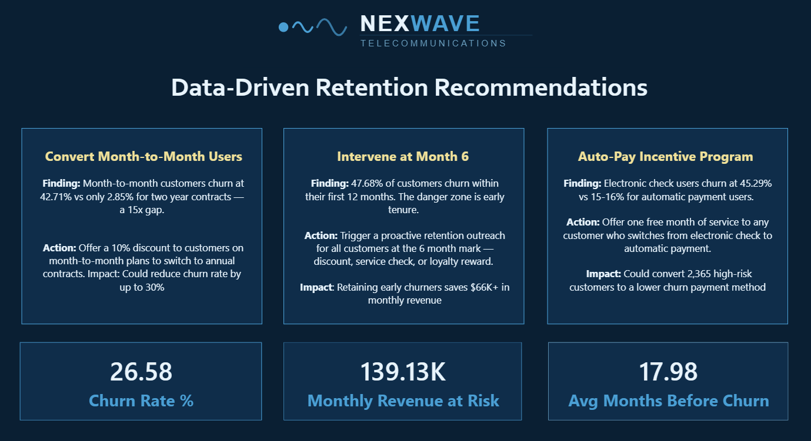

# Customer Churn Analysis — NexWave Telecommunications


## Project Overview

An end-to-end data analysis project investigating customer churn patterns for a fictional telecom company, NexWave Telecommunications. The project identifies key churn drivers, quantifies revenue at risk, and delivers three data-backed retention recommendations for business stakeholders.

**Tools Used:** Python, SQL (PostgreSQL), Power BI  
**Dataset:** IBM Telco Customer Churn — 7,032 customers, 21 features  
**Project Type:** Exploratory Data Analysis, Business Intelligence, Dashboard Reporting

---

## Business Problem

NexWave is losing 1 in 4 customers every year. With a churn rate of 26.58% and $139,130 in monthly revenue at risk, the business needed to understand:
- Who is churning and why?
- Which customer segments are highest risk?
- What actions can reduce churn?

---

## Key Findings

| Finding | Metric |
|---|---|
| Overall churn rate | 26.58% |
| Monthly revenue at risk | $139,130 |
| Month-to-month contract churn rate | 42.71% |
| Two year contract churn rate | 2.85% |
| New customer churn rate (0-12 months) | 47.68% |
| Electronic check user churn rate | 45.29% |
| Avg monthly charge — churned customers | $74.44 |
| Avg monthly charge — retained customers | $61.31 |

---

## Dashboard

### Page 1 — Executive Summary


### Page 2 — Customer Segments


### Page 3 — Recommendations


---

## Business Recommendations

**1. Convert Month-to-Month Users**  
Month-to-month customers churn at 15x the rate of two year contract customers. Offering a 10% discount to switch to annual contracts could significantly reduce overall churn.

**2. Intervene at Month 6**  
47.68% of customers churn within their first 12 months. A proactive retention outreach at the 6 month mark — loyalty reward, service check, or discount — targets the highest risk window.

**3. Auto-Pay Incentive Program**  
Electronic check users churn at 45.29% vs 15-16% for automatic payment users. Offering one free month to switch to auto-pay could convert 2,365 high-risk customers to a lower churn segment.

---

## Project Structure
```
customer-churn-analysis/
│
├── data/
│   └── telco_churn_cleaned.csv
│
├── notebooks/
│   └── churn_eda.ipynb
│
├── sql/
│   └── churn_queries.sql
│
└── dashboard/
    └── churn_dashboard.pbix
```

---

## Python EDA Highlights

- Cleaned and processed 7,032 customer records
- Converted TotalCharges from object to float, handled 11 null values
- Generated 5 visualizations using Matplotlib and Seaborn
- Identified tenure, contract type, and payment method as top churn predictors

---

## SQL Analysis Highlights

- Imported cleaned dataset into PostgreSQL
- Wrote 8 business queries including CTEs, CASE statements, and window functions
- Used RANK() OVER (PARTITION BY) to segment customers by spend within churn groups
- Quantified revenue lost by internet service type — fiber optic accounts for $114,300 of monthly loss

---

## How to Run

**Python EDA:**
```bash
pip install pandas numpy matplotlib seaborn jupyter
jupyter notebook notebooks/churn_eda.ipynb
```

**SQL:**
```sql
-- Import telco_churn_cleaned.csv into PostgreSQL
-- Run queries from sql/churn_queries.sql
```

**Power BI:**
- Open `dashboard/churn_dashboard.pbix` in Power BI Desktop
- Reconnect data source to your local `telco_churn_cleaned.csv` if prompted

---

## Dataset

IBM Telco Customer Churn dataset from Kaggle.  
7,043 rows, 21 columns covering customer demographics, services, contract details, and churn status.

---

## Author

**Saksham Dudeja**  
B.Tech Computer Science Engineering — Hindu College of Engineering  
[LinkedIn](https://linkedin.com/in/saksham-dudeja) | [GitHub](https://github.com/skshmdudeja)
